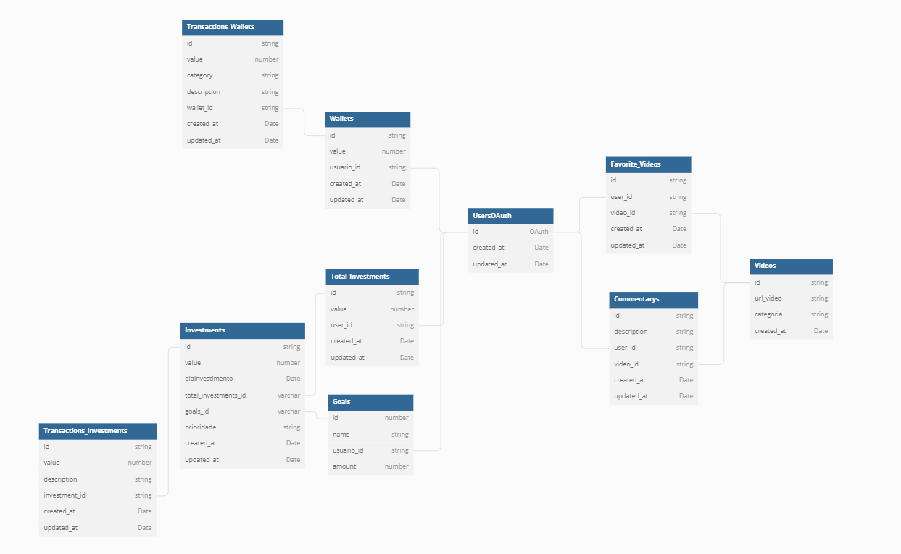

# API Finances



# User (Usuário)
- Definir o que deve ser feito ainda de

<br/>
<br/>
<br/>

# Wallet (Carteira)

## INTERFACE

 ```ts
Wallet {
  id: string;
  value: number; 
  category: string;  // Verificar se categoria tem a ver com a Entrada/Saida do value(valor -> dinheiro), caso tenha remover esse campo e criar uma tabela "transactions_wallets" para fazer o gerenciamento de entrada e saida
  description: string;
  usuario_id: string | number; // Verificar se é uma string ou number que vem do token do OAuth2
  created_at: Date;
  updated_at: Date;
 }
 ```
 <hr/>

<br/>
<br/>
<br/>

# Investments (Investimentos)

## INTERFACE

 ```ts
Investment {
  id: string;
  value: number; 
  dayInvestiment: Date;
  priority: string; //"Alta prioridade", "Média prioridade", "Baixa prioridade" Válido criar uma tabela de seed ou transformar o campo em ENUM
  usuario_id: string | number;
  created_at: Date;
  updated_at: Date;
 }

 // Criar uma tabela chamada: transactions_investments

 // Talvez deve-se criar uma tabela Total_Investment -> que faz relacionamento com Investment -> assim para cada Investment poderiamos pegar esse valor e obter o total nesta tabela. OBS: isso so faz sentido se o Investment so existir para cada Meta, ou seja um relacionamento entre eles.
 ```
 <hr/>

<br/>
<br/>
<br/>

 # Goals (Metas)

 ## INTERFACE
 ```ts
Goal {
  id: string;
  name: number; 
  usuario_id: string | number;
  time: Date
  created_at: Date;
  updated_at: Date;
 }

 // Talvez tabela Goal deve se relacionar com a Investment
 ```
 <hr/>

<br/>
<br/>
<br/>

# Videos

## INTERFACE
```ts
  Video {
    id: string;
    url_video: string; 
    category: string
    created_at: Date;
    updated_at: Date;
  }
```
<hr/>

<br/>
<br/>
<br/>

# Commentarys (Comentários)

## INTERFACE
```ts
  Commentary {
    id: string
    description: string
    user_id: string 
    video_id: string 
    created_at: Date
    updated_at: Date
  }
```
<hr/>

<br/>
<br/>
<br/>

# Favorite_Videos (Videos Favoritos)

## INTERFACE
```ts
  FavoriteVideo {
    id: string
    user_id: string 
    video_id: string
    created_at: Date
    updated_at: Date
  }
```
<hr/>
 


